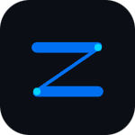

<div align="center">



# ⚡ Zenxy Workspace

**Çok Kullanıcılı, Güvenli VDS Ortak Kodlama ve İşbirliği Platformu**

[](LICENSE)
[](LICENSE)
[](package.json)

<br>

[-2563eb?style=for-the-badge&logo=windows&logoColor=white)](https://github.com/zenxy177/zenxy-workspace-app/releases/latest)

<p align="center">
  Zenxy Workspace, takımların ve geliştiricilerin kendi Windows VDS / Linux sunucuları üzerinde sıfır gecikmeyle, güvenli ve ortaklaşa kod yazmalarını sağlayan yeni nesil bir masaüstü geliştirme ortamıdır.
</p>

</div>

---

## ✨ Temel Özellikler

- 🖥️ **VDS Host & Sunucu Yönetim Paneli:** Tek tıkla yerel veya uzak sunucuyu başlatma, aktif oturumları ve donanım kullanımını (RAM/CPU) canlı izleme.
- 📁 **Gelişmiş Dosya Gezgini:** Canlı arama/filtreleme, sürükle-bırak dosya/klasör taşıma, harici işletim sisteminden çoklu dosya yükleme.
- 💻 **Dahili Güçlü Kod Editörü:** Sözdizimi vurgulama, font boyutu kontrolü (Ctrl + / -), sözcük sarma (Alt + Z), gelişmiş metin arama widget'ı (Ctrl + F).
- 👥 **Granüler İzin ve Kullanıcı Yönetimi:** Kullanıcı bazlı `canRead`, `canWrite`, `canDelete`, `canTerminal` ve özel klasör sınırlandırma yetkileri.
- 🔒 **Şifre Güçlülüğü Ölçeri:** Entropi ve kriter bazlı canlı şifre güç seviyesi denetimi.
- 🛡️ **Kurumsal Güvenlik & Sandbox:**
  - Path Traversal (Dizin Dışına Çıkma) Engelleme
  - IP Bazlı Brute-Force Karantinası (5 denemede 15 dk blokaj)
  - Katman-7 Kayan Pencereli Rate Limiter (Anti-Flood)
  - WebSocket Soket Seli Koruması
  - 20 MB Bellek / Çökme Koruması
- 📜 **Canlı Güvenlik & Denetim Logları:** Kimin ne zaman hangi dosyayı düzenlediğini veya bağlandığını anlık WebSocket akışı ile izleme.

---

## 🚀 Başlangıç ve Kurulum

### Gereksinimler
- [Node.js](https://nodejs.org/) (v18 veya üstü)
- npm veya yarn

### Adımlar

1. **Bağımlılıkları Yükleyin:**
   ```bash
   npm install
   ```

2. **Uygulamayı Başlatın:**
   ```bash
   npm start
   ```

3. **Yalnızca Sunucu (Headless / VDS) Modunda Çalıştırma:**
   ```bash
   npm run start:server
   ```

---

## 🔒 Güvenlik Mimarisi ve Testler

Uygulamanın güvenlik ve mimari test süitini çalıştırmak için:
```bash
npm test
```

---

## ⚖️ Telif Hakkı ve Lisans

Bu yazılımın tüm telif hakları saklıdır (**All Rights Reserved**).  
Kaynak kodları yalnızca inceleme ve yetkili kullanım içindir; hak sahibinin izni olmadan kopyalanamaz, yeniden dağıtılamaz veya satılamaz. Detaylar için [`LICENSE`](LICENSE) dosyasını inceleyiniz.
